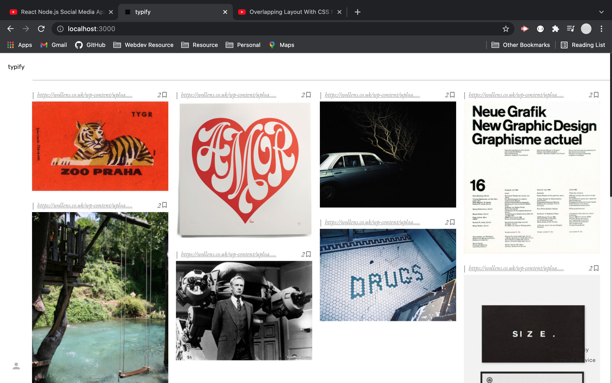

 

<h3 align="center">Typify</h3>

  

Blog application for sharing images. 
     
    <a href="https://typify-23c41.web.app/">View Demo</a>
    
  

  
Table of Contents

  <ol>
    <li>
      <a href="#info">Info</a>
      <ul>
        <li><a href="#built-with">Built With</a></li>
      </ul>
    </li>
    <li><a href="#roadmap">Roadmap</a></li>
    <li><a href="#license">License</a></li>
    <li><a href="#contact">Contact</a></li>

  </ol>

## Info

   

Built like an image blog app with the feature of letting users create their own accounts to bookmark any post within the website. Admins are the only users who can curate website.

(<a href="#top">back to top</a>)

### Built With

- [React.js](https://reactjs.org/)
- [Axios](https://axios-http.com/)
- [Firebase](https://firebase.google.com/)

(<a href="#top">back to top</a>)

## Roadmap

- Still in production...

 

See the [open issues](https://github.com/octaviusg/typify/issues) for a full list of proposed features (and known issues).

## License

Distributed under the MIT License.

(<a href="#top">back to top</a>)

## Contact

Octavio Garcia - [@octaviodevs](https://www.instagram.com/octaviodevs/) - hello@octaviogarcia.co

Project Link: [https://github.com/octaviusg/typify](https://github.com/octaviusg/typify)

(<a href="#top">back to top</a>)

